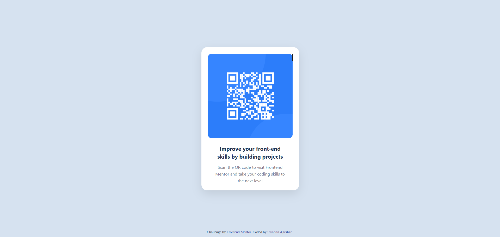
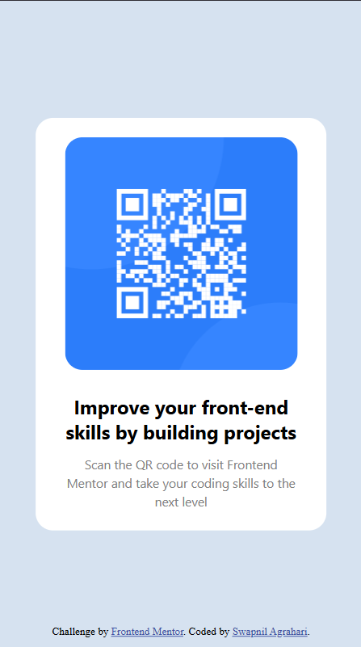

# Frontend Mentor — QR Code Component

## 📌 Overview

This is a solution to the [QR Code Component challenge on Frontend Mentor](https://www.frontendmentor.io/challenges/qr-code-component-iux_sIO_H).

## 📸 Screenshots

**Desktop:**


**Mobile:**


### The Challenge

Build a QR code card component that closely matches the provided design.

---

## 🔗 Links

- **Live Site:** [https://swapnilagrahari.github.io/qr-code-component](https://ag-swapnil1.github.io/qr-code-component/)
- **Frontend Mentor Solution:** *(add your solution URL here)*

---

## 🛠️ Built With

- Semantic HTML5 markup
- CSS custom properties
- Flexbox
- Mobile-first workflow

---

## 📁 Project Structure

```
qr-code-component/
├── .github/
│   └── workflows/
│       └── deploy.yml        # Auto-deploy to GitHub Pages
├── docs/                     # Design assets / previews
|       ├── desktop-preview.png
|       └── mobile-preview.png
├── images/
|       ├── README.md
│       ├── favicon-32x32.png
│       └── image-qr-code.png
├── .gitignore
├── LICENSE
└── README.md
├── index.html            # Main HTML entry point
├── style.css         # Main stylesheet
```

---

## 💡 What I Learned

- Centering elements both vertically and horizontally using Flexbox
- Applying `box-shadow` for card depth and elevation
- Using responsive units and media queries for smaller viewports
- Structuring a clean, accessible HTML layout with semantic tags

---

## 🚀 Getting Started

```bash
# 1. Clone the repository
git clone https://github.com/swapnilagrahari/qr-code-component.git

# 2. Navigate into the project
cd qr-code-component

# 3. Open in browser
open src/index.html
```

No build tools or dependencies required — pure HTML & CSS.

---

## 👤 Author

- **GitHub:** [@swapnilagrahari](https://github.com/swapnilagrahari)
- **Frontend Mentor:** [@swapnilagrahari](https://www.frontendmentor.io/profile/swapnilagrahari)

---

## 📄 License

This project is open source and available under the [MIT License](./LICENSE).
